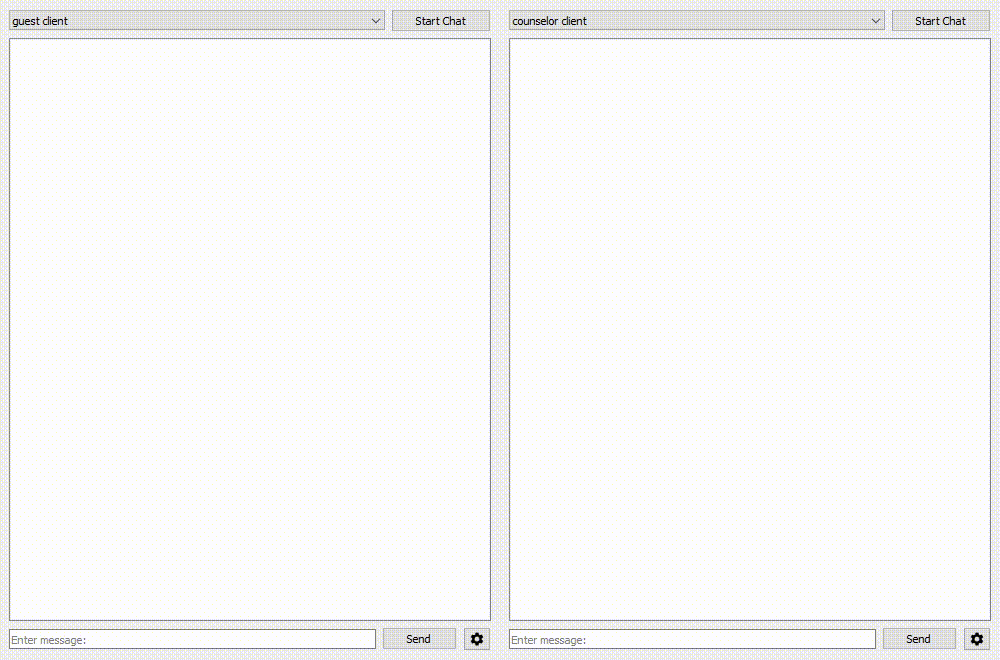
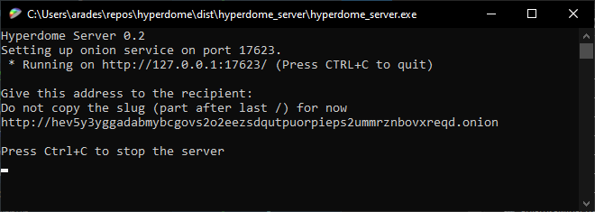
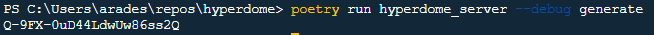
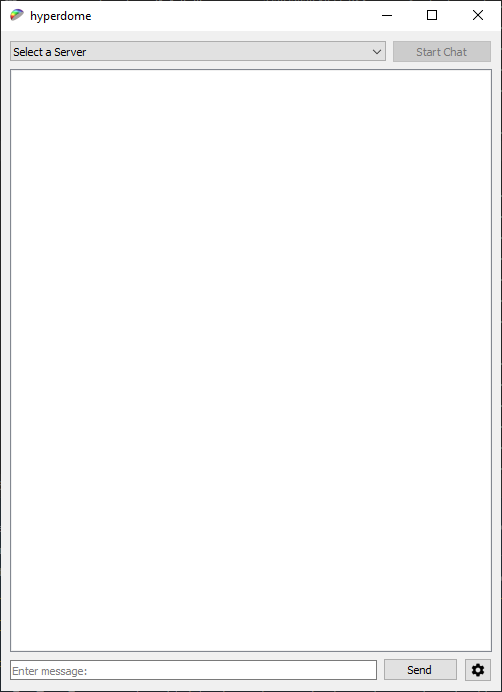

# Hyperdome

The safest place to reach out

## Concept

An anonymous, asymmetrical, and distributed conversation application. Composed of a server and client component. The server is lightweight and will allow administrators to add sign ins for various forms of counsel. A counselor would use the client to sign into a server, and a guest would connect to the server without credentials to be matched to a counselor.

This allows people to reach out anonymously and privately with some form of guarantee from the server administrators that the counselor the guest is talking to is qualified. Additionally the client allows multiple servers to be added, meaning multiple forms of counsel can be saught, or a counselor could also be a guest in other servers.

## Use Cases

The primary use case is mental health services. University campuses or businesses can provide their students/employees anonymous access to qualified therapists. This avoids the embarassment many feel about reaching out, and is much more convenient.

Other use cases could involve law firms providing a portal for people to seek legal advice, giving users a preview of the legal counsel the firm provides without needing to provide explicit attorney client priviledge.

## Usage

This is assuming you're using the Windows binary builds, for alternate instructions see [BUILD.md](BUILD.md)

Before starting either server or client [download Tor Browser](https://www.torproject.org/download/) and have it running in the background.

### Server
The server is entirely CLI based.
Upon running the server, a terminal will open, and as long as Tor is running, you will recieve an onion address that the server is running on.

The URL can be shared to anyone with a client to add you as a server. The server will maintain the same URL across instances, so don't worry if it gets closed.

Server administrators can add new counselors to their server by generating sign-up tokens to distribute to prospective counselors by entering `hyperdome_server(.exe) generate` into a terminal in the hyperdome_server folder.

### Client

The client is very simple to use, go in the client folder and open `hyperdome.exe`. First you'll need to add a server, click the *Select Server* dropdown, and add a server. Using the dialog, enter the onion address for a hyperdome server, and put in a nick-name for the server to help you remember what that server specializes in.

To add a server you intend to be a counselor for, click the counselor radio button, enter a username you don't mind the Server seeing, and your one-time counselor password.

When you're ready to chat, just press *Start Chat*. Counselors will wait for a Guest to be paired with them, and Guests will connect to a random counselor. When you're done just hit *Disconnect*. Don't worry, all messages are encrypted not only by the Tor network, but by additional end-to-end encryption. Not to mention, all IPs are obscured by the onion protocol, and absolutely no chat metadata is stored. Hyperdome takes privacy and security very seriously!

## Disclaimer
Hyperdome is currently still pre-release software! At this time it is not reccomended to deploy a hyperdome server, or encourage its wide use. Hyperdome has not been independently audited, and cannot be guaranteed to be safe. Also all interfaces are considered unstable, Server and client code may change drastically at any time. If you're still interested in demoing the software then feel free to build or run a release and do spread the word!

## Discussion
Hyperdome has a [Discord server](https://discord.gg/M2JVQa7)! Join to see discussion on development
Hyperdome also has a [matrix server](https://matrix.to/#/+hyperdome:matrix.org)! It isn't very active at the moment, but if it recieves enough attention I'll work to establish puppeting between the two so nobody is out of the loop!

#### Contact
If this software/concept intrests you, you may also reach out to me personally: scravers@protonmail.com
I'd love to hear your potential use cases, or any interest in testing the software!